<h1 align="center">Weekend Warrior (API)</h1>

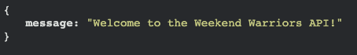

This repository forms the API aspect of my wider 'Weekend Warrior' app. This README contains all the relevent information pertaining to the planning, structure and functionality of the back-end API. Please use the links below to navigate to other relevant sections of the project itself:

[Deployed API Site](https://weekend-warrior-api.herokuapp.com)

[Deployed Site](https://weekend-warrior-nickdevc.herokuapp.com)

[Front-end Repository](https://github.com/NickdevC/weekend-warrior-react/)

---
  
## Contents

*  [Purpose](#purpose)
*  [Database Schema](#database-schema)
*  [Models](#models)
*  [Testing](#testing)
*  [Bugs](#bugs)
*  [Technologies Used](#technologies-used)
*  [Deployment](#deployment)
*  [Credits](#credits)

---
  
# Purpose

The purpose of [the Weekend Warrior API](https://weekend-warrior-api.herokuapp.com) is to provide a back-end interface for managing user input from the main front-end site. To this end, the API is responsible for creating, storing, updating and filtering user data, with the overall goal of making sure the Weekend Warrior site delivers on it's core functionality as a social media hub. By it's nature, Weekend Warrior will only be successful if the user is able to quickly navigate and seamlessly interact with the functionality of the site - it is vital therefore that the API is designed to fit the audiences' needs.
  
The API allows users to register an account, and in doing so create a unique profile that they are then able to edit. They can also view others' profiles and choose to follow/unfollow other users (a standard practise with social media sites). In addition to this, once authenticated, users are able to **post** their recent 'adventures', **comment** on others' posts and also **favourite** posts so that they can easily access them at a later date.

---
  
# Database Schema 

Using [DrawSQL](https://drawsql.app/) I was able to carefully plan out my database structure, and ensure that I had considered the relationships between them. 
  
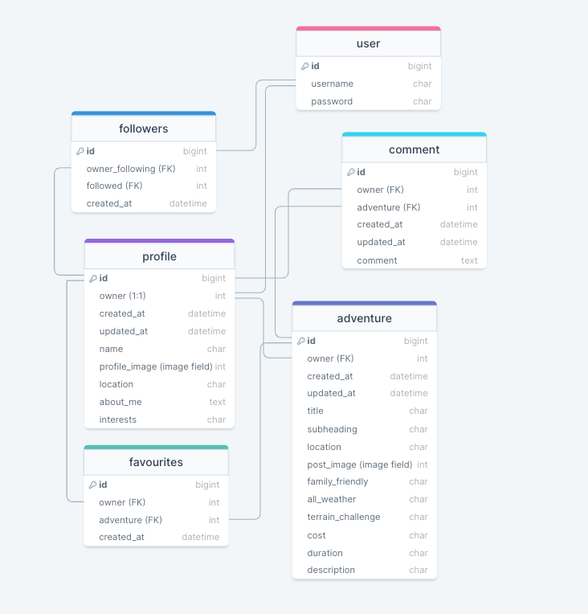

[Return to contents](#contents)
  
---

# Models

## Profile

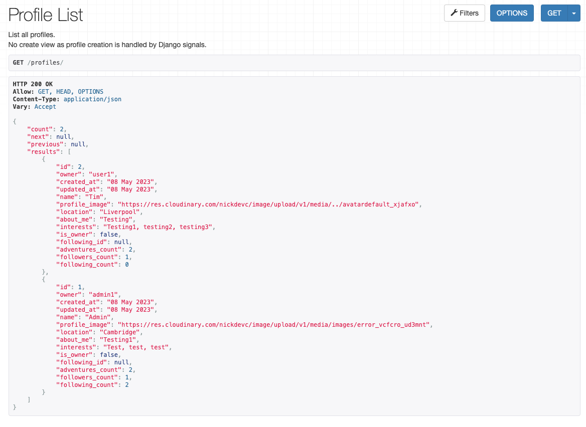

## Adventure

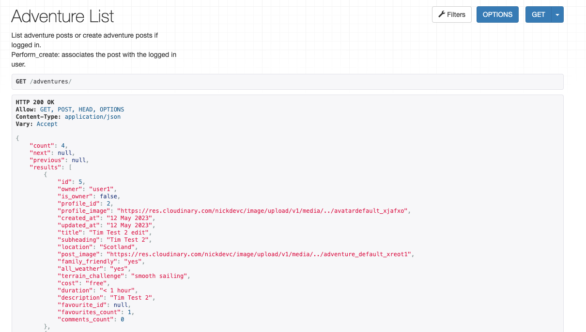

## Comment

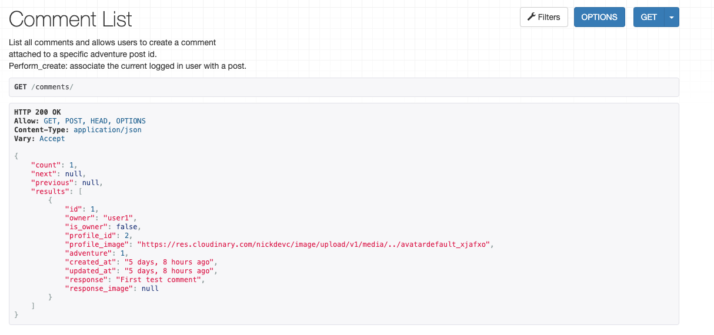

## Followers
  
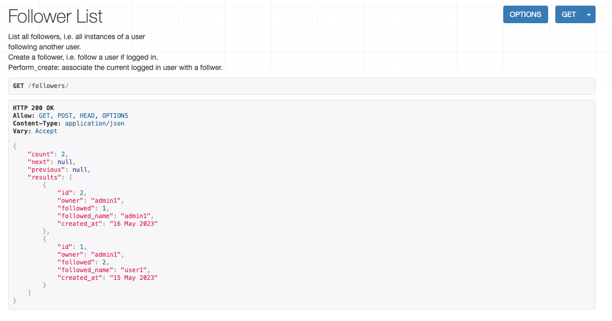

## Favourites
  
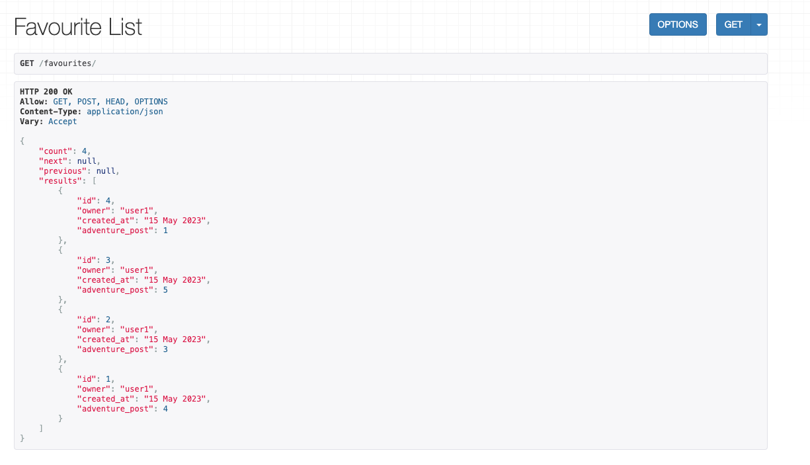
  
  
[Return to contents](#contents)

---

# Testing

## Unit Tests

Following the CI tutorial (moments), I was able to create a run tests pertaining to my "adventures" model. All tests passed, aside from two anomalies (both of which were confirmed by tutor support as things that could be left). **Please see the 'Bugs' section to see these errors in more detail.**

### Adventure Detail View 
  
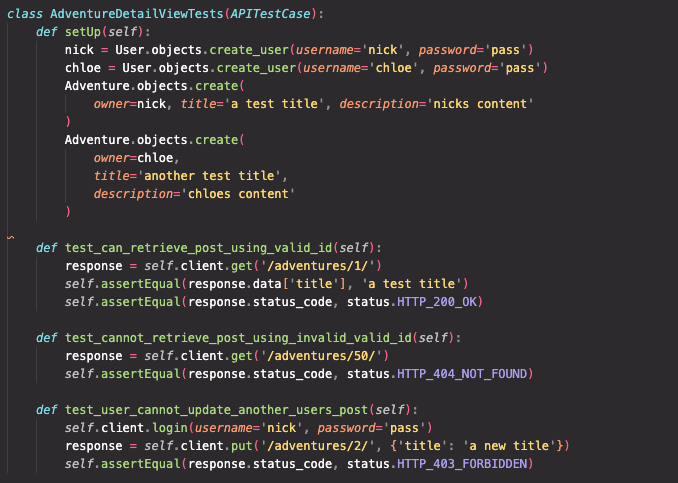

### Adventure List View
  
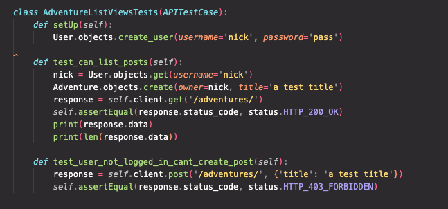

## Manual Tests
  
Throughout the development process, I continued to test the data being presented in the api, using a mixture of the Django Rest Framework interface and the deployed api url links.

Example of the routine outputs I was inspecting:
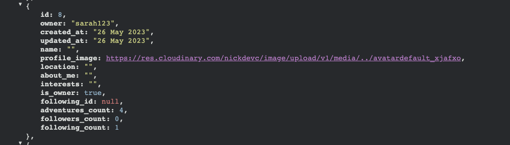

I also ensured that the api fulfilled all the CRUD functionaility necessary for my app:  

| App/feature | Create| Read | Edit | Delete |
| ------ | ------ | ------ | ------ | ------ |
| profiles | PASS | PASS | PASS | PASS |
| adventures | PASS | PASS | PASS | PASS |
| comments | PASS | PASS | PASS | PASS |
| followers | PASS | PASS | PASS | N/A |
| favourites | PASS | PASS | PASS | N/A |

## Validator Tests

Using the PEP8 validator plugin in Gitpod, I was able to identify any syntax issues. The only remaining error is a 'line length' error linked to code in the env.py file which could not be altered.
  
[Return to contents](#contents)

# Bugs
  
Whilst most bugs were minor and fixed on an ad-hoc basis, there were two bugs that persisted through to deployment and I have outlined these below:

| Location | Description | Solution |
| ------ | ------ | ------ |
| 'adventures' app > tests.py | `test_logged_in_user_can_create_post` continued to return with: `AssertionError: 0!=1` | I tried to alter the code to ensure the `self.assertEqual` count returned the desired value, but was unsuccessful. Having spoken to tutor support, it was deemed an anomaly and I was informed to ignore the error. |
| 'adventures' app > tests.py | `test_user_can_update_own_post` returned: `AssertionError: 'a test title' != 'a new title'` | Again, tutor support informed me to leave the error and move on. |

[Return to contents](#contents)

# Technologies Used 

## Languages
  
The main language used was **python**, mainly due to the fact that the project utilised Django Rest Framework. 

## Modules
  
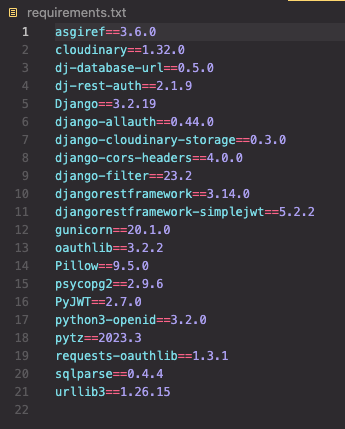

## Frameworks/Libraries
  
- Django Rest Framework
- Django Cloudinary Storage
- Django Rest Auth
- PostgreSQL
- Pillow
- Corsheaders

## Platforms
  
- Github
- Gitpod
- Cloudinary
- Heroku
- ElephantSQL

## Other Resources
  
- DrawSQL

[Return to contents](#contents)

---

# Deployment

## Forking the GitHub Repository

1. Go to [the project repository](https://github.com/NickDevC/ww-api)
2. In the right most top menu, click the `Fork` button.
3. This 'forks' the api repository and creates a clone repository in your own GitHub account!

### Making a local clone

1. Go to [the project repository](https://github.com/NickdevC/ww-api)
2. Then, click on the `Code` button.
3. Choose one of the three options (HTTPS, SSH or GitHub CLI) and then click copy.
4. Open the terminal in you IDE program.
5. Type "`git clone`" and paste the URL that was copied in step 3.
6. Press Enter and the local clone will be created!

### Alternatively by using Gitpod:

1. Go to [the project repository](https://github.com/NickdevC/ww-api)
2. Click the green button that says "Gitpod" and the project will now open up in Gitpod.

## Deploying with Heroku

The following command in the Gitpod CLI will create the relevant files needed for Heroku to install the project dependencies `pip3 freeze --local > requirements.txt`. **Please note this file should be added to a .gitignore file to prevent the file from being committed!**

1. Go to [Heroku.com](https://dashboard.heroku.com/apps) and log in; if you do not already have an account then you will need to create one.
2. Click the `New` dropdown and select `Create New App`.
3. Enter a name for your new project, all Heroku apps need to have a unique name, you will be prompted if you need to change it.
4. Select the region you are working in.

### Heroku Settings  
  
You will need to set your Environment Variables - **this is a key step to ensuring your application is deployed properly**.
1. In the Settings tab, click on `Reveal Config Vars` and set the following variables:
    - Key as `ALLOWED_HOSTS` and the value as the name of you project with '.herokuapp.com' appended to the end e.g.  `example-app.herokuapp.com`. Click the Add button.
    - Key as `CLOUDINARY_URL` and the value as your cloudinary API Environment variable e.g. `cloudinary://**************:**************@*********`. Click the Add button.
    - Key as `SECRET_KEY` and the value as a complex string which will be used to provide cryptographic signing. The use of a secret key generator is recommended such as [https://djecrety.ir](https://djecrety.ir/). Click the Add button.
    - Ensure the key `DATABASE_URL` is already populated. This should have been created automatically by Heroku.
    - The `DATABASE_URL` should be copied into your local `.env`, created during the cloning process.
    - To make authenticated requests to this API (e.g. from a fontend application) you are required to add the key `CLIENT_ORIGIN` with the value set as the URL you will be sending the authentication request from.
    - Additionally, a `CLIENT_ORIGIN_DEV` key can be set with the value of a development server (IP or URL) for use during local development.

### Heroku Deployment

In the Deploy tab:

1. Connect your Heroku account to your Github Repository following these steps:
   - Click on the `Deploy` tab and choose `Github-Connect to Github`.
   - Enter the GitHub repository name and click on `Search`.
   - Choose the correct repository for your application and click on `Connect`.
2. You can then choose to deploy the project manually or automatically, automatic deployment will generate a new application every time you push a change to Github, whereas manual deployment requires you to push the `Deploy Branch` button whenever you want a change made.
3. Once you have chosen your deployment method and have clicked `Deploy Branch` your application will be built and you should now see the `View` button, click this to open your application.

# Credits

## Websites

* [DrawSQL](https://drawsql.app/) - used for creating the model schemas.

## Acknowledgements

* The Code Institute walkthrough projects for providing structure and direction for my personal project.
* My mentor Martina Terlevic who has accomodated me along the way, supporting with queries 'on the fly' and providing invaluable guidance during project milestone meetings. 
* CI tutor support for helping with some early dependency issues (a fair amount of tweking was required before I could get off the ground).
* I also want to thank [Chris.F](https://github.com/Chrisfaherty) and [Chris.B](https://github.com/Christoph33one) (fellow Code Institute students). By joining together and engaging in remote study sessions your conversation and input kept me on track and motivated to push myself with regards to the project. Your advice and constructive questions kept me in check!

[Return to contents](#contents)
